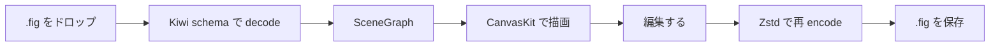

<div align="center">

# Inkly

**ブラウザの中で動く、 オープンソースのデザインエディタ。**

`.fig` を開いて、 編集して、 招待リンクで配る。 アカウントもインストールも要らない。

[ブラウザで試す](https://pencil-editor.fly.dev) ・ [ドキュメント](https://inkly.dev) ・ [ダウンロード](https://github.com/cardene777/open-pencil/releases/latest) ・ [llms.txt](https://inkly.dev/llms.txt)


<sub>高画質 mp4 (51 秒 / 12 MB) → [packages/docs/public/pencil-editor-promo.mp4](packages/docs/public/pencil-editor-promo.mp4)</sub>

</div>

---

## 30 秒で動かす

ブラウザで開く場合。

```
https://pencil-editor.fly.dev
```

ローカルで開発する場合。

```sh
git clone git@github.com:cardene777/open-pencil.git
cd open-pencil
bun install
bun run dev:full
```

`http://localhost:1420` でランディング、 `/dashboard` でボード一覧、 `/editor` でエディタ。

CLI だけ欲しい場合。

```sh
brew install inkly
inkly tree design.fig
```

---

## Inkly が解く課題

Figma は強い、 ただし閉じている。

- ファイルは独自バイナリ、 公式ソフトでしか完全には読めない
- プログラマブル経由 (CDP) は version 126 で塞がれた
- MCP サーバは read-only、 AI に「デザインを直してもらう」 ができない
- ベンダーがバージョンを上げるたびにワークフローが壊れる

Inkly はその裏返しを取る。

| 観点 | Figma | Inkly |
|---|---|---|
| ライセンス | プロプライエタリ | MIT |
| `.fig` 読み書き | 公式ソフトのみ | ネイティブ、 CLI / SDK / MCP どこからでも |
| AI からの編集 | 公式 MCP は read-only | 100+ tool で create / modify / export 可能 |
| データの保存先 | Figma のサーバ | 手元 (ローカル / セルフホスト) |
| カスタマイズ性 | プラグイン枠だけ | ソース全部、 fork して詰める |

---

## 3 つの使い方

### 1. ブラウザでそのまま編集する

`.fig` をブラウザにドロップすると、 16 画面でも 40 画面でもネイティブで開く。 編集はそのままインライン、 保存もブラウザの中で完結。 全ファイルは IndexedDB に永続化され、 次に開いたとき復元される。



### 2. AI に「デザインを直してもらう」

`⌘` + `J` で内蔵 AI を開く。 100+ tool が、 形状作成 / 塗り / 線 / auto layout / コンポーネント / 変数 / ブーリアン / トークン解析 / アセット export まで担当する。

API キーは自前のものを使う (OpenRouter / Anthropic / OpenAI / Google AI / Z.ai / MiniMax)。 バックエンド不要、 アカウント不要。

デスクトップアプリ + ローカル CLI なら、 Claude Code / Codex / Gemini CLI をエディタの中に接続できる。 エージェントが MCP 経由で 100+ tool を直接叩く。

```sh
# Claude Code から Inkly を操作する例
npm install -g @agentclientprotocol/claude-agent-acp
# settings.json で mcp__inkly__* を allow
# デスクトップアプリで ⌃J → Claude Code を選択
```

### 3. リンク 1 本でチームに配る

ボードを開いて「共有」を押すと、 招待 URL が発行される。 URL を踏んだ相手は別タブで同じデザインを開く、 サーバ経由ではなく WebRTC P2P。 カーソル / 選択 / 編集はリアルタイムで同期する。

招待 URL は Slack でも LINE でもメールでも貼れる、 受け取った側はリンクを踏むだけで参加できる。 アカウント不要、 招待先のメールアドレス入力も不要。

---

## ヘッドレスで全部できる

エディタ UI に触らず、 ファイル / 設計システムを CLI と MCP だけで運用できる。

### `.fig` を inspect する

```sh
inkly tree design.fig                                  # ノード木構造
inkly find design.fig --type TEXT                      # 型で検索
inkly query design.fig "//FRAME[@width < 300]"          # XPath クエリ
inkly info design.fig                                  # 情報サマリ
```

```
[0] [page] "Getting started"
  [0] [section] ""
    [0] [frame] "Body"
      [0] [frame] "Introduction"
        [0] [frame] "Introduction Card"
```

### 解析してデザイントークンを抽出

```sh
inkly analyze colors design.fig
inkly analyze typography design.fig
inkly analyze spacing design.fig
inkly variables design.fig
```

```
#1d1b20  ██████████████████████████████ 17155×
#49454f  ██████████████████████████████ 9814×
#ffffff  ██████████████████████████████ 8620×
#6750a4  ██████████████████████████████ 3967×

3771× frame "container" (100% match)
     size: 40×40, structure: Frame > [Frame]
```

### コードへ落とす

```sh
inkly export design.fig -f jsx --style tailwind
inkly export design.fig -f svg
inkly export design.fig -f png -s 2
```

```html
<div className="flex flex-col gap-4 p-6 bg-white rounded-xl">
  <p className="text-2xl font-bold text-[#1D1B20]">Card Title</p>
  <p className="text-sm text-[#49454F]">Description text</p>
</div>
```

### スクリプトで書き換える

`eval` で Figma Plugin API がそのまま使える。

```sh
inkly eval design.fig -c "figma.currentPage.children.length"
inkly eval design.fig -c "figma.currentPage.selection.forEach(n => n.opacity = 0.5)" -w
```

### Lint で品質を保つ

```sh
inkly lint design.fig                          # default ruleset
inkly lint design.pen --preset strict          # 厳格
inkly lint design.fig --rule color-contrast    # 単独ルール
```

### AI エージェントから叩く (MCP)

Claude Code / Cursor / Windsurf に直接繋ぐ。

```sh
npm install -g @inkly/mcp
claude mcp add --scope user inkly -- inkly-mcp
```

すべての CLI コマンドは `--json` で機械可読出力に対応している。

---

## なぜ動くのか — 互換性の仕組み

`.fig` の仕様は Figma 公式公開されていない。 それでも Inkly が読み書きできる理由は 3 層に分かれる。

1. **Kiwi serialization 言語** — Figma 共同創業者 Evan Wallace が個人 OSS で公開している。 protobuf 風のバイナリ schema 言語、 これ自体は public
2. **fig.kiwi (5,623 行)** — Figma desktop app の binary 解析 / multiplayer 通信観測 / 先行 OSS (Penpot / figma-use) からの抽出を curated merge したもの
3. **forward 互換性** — Kiwi のタグ番号付きフィールドは追加に強い、 schema が古くてもほとんどのファイルは開ける

詳細は [Figma Compatibility](https://inkly.dev/reference/figma-compatibility) を参照。

法律面は interoperability 目的の reverse engineering を許容する区域 (US DMCA §1201(f) / EU Directive 2009/24 / 日本著作権法 30-4 + 47-4) で grey-but-allowed、 Figma TOS には反するが過去 OSS への訴訟例はない。 ユーザー自己責任で使う。

---

## 機能一覧

| 領域 | 機能 |
|---|---|
| ファイル | `.fig` / `.pen` ネイティブ、 SVG / PDF / PNG / JPG / WEBP export、 JSX / Tailwind 出力 |
| 編集 | auto layout / CSS Grid (Yoga WASM)、 コンポーネント / バリアント、 変数 / トークン、 boolean 演算 |
| AI | 100+ tool 内蔵チャット、 multi-provider (OpenRouter / Anthropic / OpenAI / Google AI / Z.ai / MiniMax) |
| エージェント | Claude Code / Codex / Gemini CLI を MCP 経由で接続、 デスクトップアプリ内に統合 |
| プログラマブル | ヘッドレス CLI、 XPath クエリ、 Figma Plugin API (eval)、 MCP サーバ (stdio + HTTP)、 Vue SDK |
| コラボ | WebRTC P2P (Trystero + Yjs)、 カーソル / プレゼンス / フォローモード、 招待 URL 共有 |
| デスクトップ | Tauri v2 (~7 MB)、 macOS / Windows / Linux、 ブラウザでは PWA |
| 検査 | lint (a11y / 命名 / レイアウト)、 デザイントークン抽出、 色 / タイポ / 余白 / クラスタ解析 |
| 通知 | 未読バッジ、 ボード招待 / チーム招待 / メンションの通知センター |

---

## どう統合するか — Vue SDK

ヘッドレスコンポーネントを使って、 ワークフロー特化のエディタを自前アプリに埋め込める。

```vue
<script setup lang="ts">
import { createEditor } from '@inkly/vue'

const editor = await createEditor({
  document: '/path/to/design.fig',
  tools: ['select', 'frame', 'text']
})
</script>

<template>
  <InklyCanvas :editor="editor" />
  <InklyToolbar :editor="editor" />
</template>
```

カスタムサイドバー / プロパティパネル / ツールバーを自前で組み、 内部のエンジン (scene graph / renderer / file IO) だけ Inkly に任せる。 詳細は [SDK ドキュメント](https://inkly.dev/programmable/sdk/) を参照。

---

## コントリビュート

### 環境を作る

```sh
bun install
cp .env.local.example .env.local
bun run dev:full
```

env ファイルは 2 種から選ぶ (両方持っていてよい)。

| file | 用途 |
|---|---|
| `.env.local` | 完全ローカル開発 (SQLite ファイル / dummy secret / オフライン OK) |
| `.env.dev` | ローカル PC で実 DB + 実 OAuth に接続 (Turso / Google ログイン本物) |

`scripts/dev.sh` は `.env.dev` を優先し、 無ければ `.env.local` を読む。

### 個別起動

```sh
bun run dev        # Vite のみ        (localhost:1420)
bun run dev:api    # API server のみ  (localhost:3001)
bun run tauri dev  # デスクトップ      (Rust 必要)
```

API なしで Vite だけだと `/dashboard` / `/boards` の auth 必須画面で 「Failed to load session」 になる。 エディタ (`/` / `/editor`) は API なしでも開く。

### 品質ゲート

| コマンド | 内容 |
|---|---|
| `bun run check` | Lint + typecheck |
| `bun run test` | E2E visual regression |
| `bun run test:unit` | 単体テスト |
| `bun run coverage:report` | 単体 + デモ E2E カバレッジのマージ summary |
| `bun run format` | コードフォーマット |

カバレッジ成果物は `.context/coverage/` 配下 (git ignore)。

### Turso / Google OAuth / Resend

詳細セットアップ手順は docs を参照。 値が空のまま運用すると、 機能は **配線済みだが動かない** 状態で安全に turn off される (OAuth ボタンは「未設定」表示、 招待メールは no-op、 ローカル SQLite に fallback)。

---

## プロジェクト構成

```
packages/
  core/           @inkly/core   エンジン (シーングラフ / レンダラ / レイアウト / ファイル IO)
  vue/            @inkly/vue    ヘッドレス Vue SDK
  cli/            @inkly/cli    ヘッドレス CLI
  mcp/            @inkly/mcp    MCP サーバ (stdio + HTTP)
  api/            Hono + better-auth + Drizzle + Turso/SQLite
  docs/           ドキュメントサイト (inkly.dev)
src/              Vue アプリ (LP / dashboard / boards / editor)
desktop/          Tauri v2 (Rust + config)
scripts/promo/    Remotion + Playwright によるプロモ動画 build
tests/            E2E (188) + 単体 (764)
```

---

## 技術スタック

| レイヤ | 技術 |
|---|---|
| レンダリング | Skia (CanvasKit WASM) |
| レイアウト | Yoga WASM (flex + grid via [fork](https://github.com/inkly/yoga/tree/grid)) |
| UI | Vue 3 / Reka UI / Tailwind CSS 4 |
| ファイル | Kiwi バイナリ + Zstd + ZIP |
| コラボ | Trystero (WebRTC P2P) + Yjs (CRDT) |
| 認証 | better-auth + Drizzle + Turso/SQLite |
| API | Hono |
| デスクトップ | Tauri v2 |
| AI / MCP | Anthropic / OpenAI / Google AI / OpenRouter、 MCP SDK |
| 動画生成 | Remotion + Playwright (promo build) |

---

## ロードマップ

- [x] `.fig` ネイティブ読み書き
- [x] AI 駆動デザイン生成 (内蔵チャット + コーディングエージェント)
- [x] ヘッドレス CLI / MCP サーバ
- [x] WebRTC P2P コラボレーション + 招待 URL 共有
- [x] 本番デプロイ (pencil-editor.fly.dev)
- [ ] Figma マルチプレイヤーセッションの直接読み込み
- [ ] アニメーション / インタラクション編集
- [ ] FigJam 形式の対応

最新は [ロードマップページ](https://inkly.dev/development/roadmap) を参照。

---

## 謝辞

ドキュメントサイト [inkly.dev](https://inkly.dev) の構築 / 保守を担っている [@sld0Ant](https://github.com/sld0Ant) (Anton Soldatov)、 そしてバイナリシリアライズ言語 [Kiwi](https://github.com/evanw/kiwi) を公開している [@evanw](https://github.com/evanw) (Evan Wallace、 Figma 共同創業者) に感謝。

## ライセンス

[MIT](./LICENSE)
