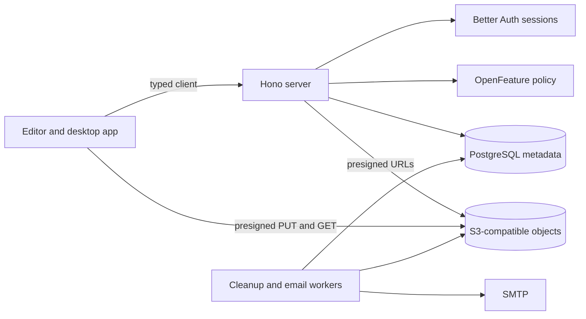

# Cloud Architecture

OpenPencil Cloud is an optional, self-hostable backend for storing, sharing, and collaborating on
documents. The editor stays local-first: opening, editing, and saving local files never needs this
package, a network connection, or an account.

`@open-pencil/cloud` holds the network contracts, a typed client, a runtime-neutral Hono server, and
the Node runtime that wires PostgreSQL, S3-compatible storage, SMTP, and background workers into it.

## Package boundaries

| Subpath                           | Contents                                                                   |
| --------------------------------- | -------------------------------------------------------------------------- |
| `@open-pencil/cloud/contract`     | Valibot schemas and types shared by every side of the network              |
| `@open-pencil/cloud/client`       | Discovery, authentication, device authorization, and the typed Hono client |
| `@open-pencil/cloud/email`        | Vue Email rendering for transactional mail                                 |
| `@open-pencil/cloud/server`       | Hono routes and services; every dependency is injected                     |
| `@open-pencil/cloud/runtime/node` | PostgreSQL, S3, SMTP, the HTTP listener, workers, and operator commands    |

The server never imports `pg`, opens a listener, runs migrations, or starts timers; runtimes do.
Browser code imports only `contract` and `client`, so it never pulls in server dependencies.

## Documents and revisions

PostgreSQL stores workspaces, membership, documents, revisions, uploads, sharing, and quota state.
Object storage stores immutable `.fig` revisions; a document points at its current revision, and every
revision has its own object key.

- Uploads go straight from the client to object storage through presigned single or multipart PUTs.
  The server verifies a SHA-256 digest before committing; ETags only complete multipart uploads.
- Each upload names the revision it was based on, so a stale base is rejected instead of silently
  overwriting a newer revision. The client then chooses: take the Cloud revision, keep both, or
  replace it.
- Deleting a document is immediate for users; the cleanup worker removes revisions and objects once
  the retention period passes.

## Authentication and authorization

Better Auth owns users, sessions, social sign-in, email and password, passkeys, TOTP, and recovery
codes. OpenPencil owns workspace and document authorization. For clients that cannot host a browser
redirect, such as the desktop app, the server supports the OAuth device authorization flow and
accepts the resulting bearer token.

Access to a document comes from ownership, workspace membership, a direct grant, or a capability
link, and the strongest source wins. Revoking one source leaves access inherited from another.
Documents granted to someone outside their own workspaces are listed for them separately, so a
client can show what was shared with them.

Database rows use UUIDs. Capability secrets and invitation tokens are random hex; only their SHA-256
digests are stored, and they travel in URL fragments so they never reach access logs or `Referer`
headers. Invitation continuations through OAuth are single-use compact JWE.

Collaboration tickets are signed, epoch-scoped JWTs naming the principal and permission. Rotating a
capability secret keeps the current epoch; revoking access advances it so old tickets stop working.

## Enrollment and administration

Enrollment is `open`, `approval`, or `closed`. In approval mode a verified identity creates a
pending request that a deployment administrator approves or rejects; approval can be revoked later.
Deployment administrators are separate from workspace administrators, and startup never grants
either role: the first operator is approved and promoted through the `admin` command.

## Configuration

Operators author one schema-versioned TOML file. It owns URLs, trusted origins and proxies,
authentication providers, enrollment, object storage, email, worker schedules, retention,
entitlements, and technical limits. Environment variables only supply secrets, through references
such as `{ from_env = "DATABASE_URL" }`, and never override a value the file sets. TOML is parsed
with `smol-toml` and then validated and normalised by Valibot.

Technical limits are safety ceilings, not entitlements: runtime policy can be stricter but never
looser.

## Policy, entitlements, and quotas

OpenFeature answers concrete questions such as whether capability links, anonymous viewing, or
revision history are available, and what a numeric limit is. A database-backed provider resolves
them from deployment capability, workspace entitlements, and document policy. Booleans need every
layer to allow them; numeric limits take the most restrictive value.

Storage quota uses reservations: the upload locks the workspace's quota row, counts committed usage
plus active reservations, reserves the requested bytes, and commits the verified size when the
upload finishes. Cleanup releases reservations from abandoned uploads.

## Rate limiting

OpenPencil routes use `hono-rate-limiter` with one PostgreSQL store that atomically increments
hashed, namespaced keys, so limits hold across instances. Better Auth keeps its own limiter for
`/api/auth/**`; those routes mount before OpenPencil middleware and are never counted twice.

## Transactional email

Vue Email renders matching HTML and plain-text bodies. Email goes through a PostgreSQL outbox: the
row is written in the same transaction as the change that caused it, payloads are encrypted at rest,
and a worker claims bounded batches with retries. The Node runtime sends through SMTP with
Nodemailer; `email.transport = "none"` disables delivery.

## Tests

| Level       | Location                                                | Needs                   |
| ----------- | ------------------------------------------------------- | ----------------------- |
| Unit        | `packages/cloud/tests/{client,contract,runtime,server}` | nothing                 |
| Integration | `packages/cloud/tests/integration`, mirroring `src`     | PGlite, in process      |
| End-to-end  | `packages/cloud/tests/e2e`                              | Docker Compose services |

`bun run test:cloud` type-checks the package and runs unit and integration tests. The end-to-end
runners start PostgreSQL and SeaweedFS (or Garage) in an isolated Compose project, exercise presigned
and multipart uploads and the full revision flow, and remove the project afterwards.
