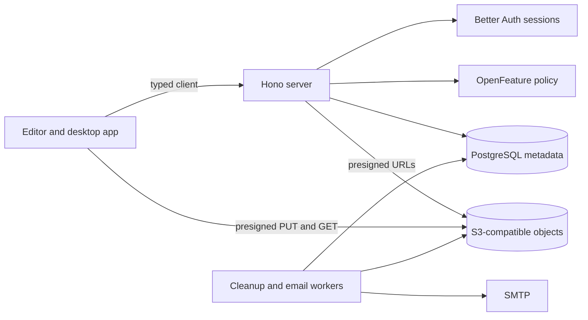
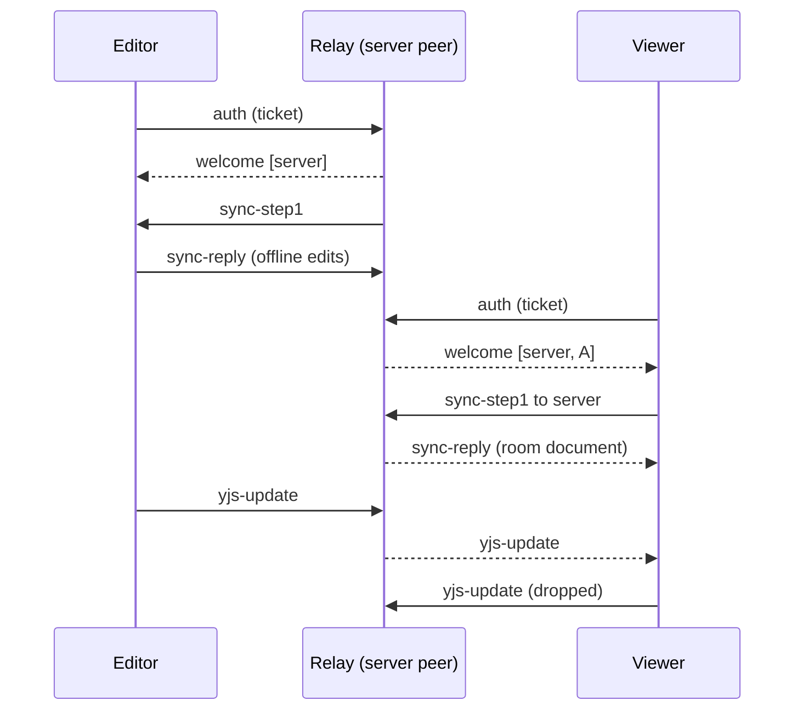

# Cloud Architecture

OpenPencil Cloud is an optional, self-hostable backend for storing, sharing, and collaborating on
documents. The editor stays local-first: opening, editing, and saving local files never needs this
package, a network connection, or an account.

`@open-pencil/cloud` holds the network contracts, a typed client, a runtime-neutral Hono server, and
the Node runtime that wires PostgreSQL, S3-compatible storage, SMTP, and background workers into it.

## Package boundaries

| Subpath                           | Contents                                                                   |
| --------------------------------- | -------------------------------------------------------------------------- |
| `@open-pencil/cloud/contract`     | Valibot schemas and types shared by every side of the network              |
| `@open-pencil/cloud/client`       | Discovery, authentication, device authorization, and the typed Hono client |
| `@open-pencil/cloud/email`        | Vue Email rendering for transactional mail                                 |
| `@open-pencil/cloud/server`       | Hono routes and services; every dependency is injected                     |
| `@open-pencil/cloud/runtime/node` | PostgreSQL, S3, SMTP, the HTTP listener, workers, and operator commands    |

The server never imports `pg`, opens a listener, runs migrations, or starts timers; runtimes do.
Browser code imports only `contract` and `client`, so it never pulls in server dependencies.

## Documents and revisions

PostgreSQL stores workspaces, membership, documents, revisions, uploads, sharing, and quota state.
Object storage stores immutable `.fig` revisions; a document points at its current revision, and every
revision has its own object key.

- Uploads go straight from the client to object storage through presigned single or multipart PUTs.
  The server verifies a SHA-256 digest before committing; ETags only complete multipart uploads.
- Each upload names the revision it was based on, so a stale base is rejected instead of silently
  overwriting a newer revision. The client then chooses: take the Cloud revision, keep both, or
  replace it.
- Deleting a document is immediate for users; the cleanup worker removes revisions and objects once
  the retention period passes.

## Authentication and authorization

Better Auth owns users, sessions, social sign-in, email and password, passkeys, TOTP, and recovery
codes. OpenPencil owns workspace and document authorization. For clients that cannot host a browser
redirect, such as the desktop app, the server supports the OAuth device authorization flow and
accepts the resulting bearer token.

Access to a document comes from ownership, workspace membership, a direct grant, or a capability
link, and the strongest source wins. Revoking one source leaves access inherited from another.
Documents granted to someone outside their own workspaces are listed for them separately, so a
client can show what was shared with them.

Database rows use UUIDs. Capability secrets and invitation tokens are random hex; only their SHA-256
digests are stored, and they travel in URL fragments so they never reach access logs or `Referer`
headers. Invitation continuations through OAuth are single-use compact JWE.

Collaboration tickets are signed, epoch-scoped JWTs naming the principal and permission. Rotating a
capability secret keeps the current epoch; revoking access advances it so old tickets stop working.

## Live collaboration

Collaboration in the editor runs Yjs sync and awareness over a `CollabRoomTransport`. Local
documents use Trystero peer to peer; Cloud documents use the Cloud relay, a WebSocket endpoint at
`/api/collaboration/relay` on the API origin. Both carry the same room messages, so the editor has
one sync implementation.

The relay joins every room as a peer named `server`. It holds the room's Yjs document, saved in
PostgreSQL by document and collaboration epoch, so a newcomer gets the document even when nobody
else is online. Tickets are short-lived signed JWTs; the client presents a fresh one before the
current one expires, and the relay closes a socket whose ticket lapsed or changed identity.

The relay enforces what the ticket allows: a viewer's document updates and sync replies never leave
it, and presence updates are rewritten so others see the ticket's name and a `cloud` field with the
verified identity and permission. A peer cannot claim presence clients another peer owns. Voice is
not carried over the relay yet; the transport reports no media.

## Enrollment and administration

Enrollment is `open`, `approval`, or `closed`. In approval mode a verified identity creates a
pending request that a deployment administrator approves or rejects; approval can be revoked later.
Deployment administrators are separate from workspace administrators, and startup never grants
either role: the first operator is approved and promoted through the `admin` command.

## Portal

The server shows its own pages on its public address: sign-in and sign-up, email verification,
password reset, two-step sign-in, desktop sign-in approval, account security, and the
administration console. They are a separate Vite entry, `cloud.html`, in the app project, so they
reuse the editor's components and theme without loading the editor; `bun run build:cloud-portal`
writes them to `dist-cloud-portal/`. The editor, on the web and on the desktop, never embeds these
pages; it opens them in a browser and gets the person back through `/auth/return` or the device
code.

`CLOUD_PORTAL_PAGE_ROOTS` in the contract lists the page paths, and every runtime serves
`cloud.html` at and below them with `frame-ancestors 'none'`, so the approval page cannot be
framed. The Node runtime serves the build named by `OPENPENCIL_CLOUD_PORTAL_DIR`, answering portal
pages before the API and portal assets only where the API returns 404. `bun run cloud:dev` keeps a
watched portal build next to the server.

## Editor client

The editor treats each Cloud server as a profile of the `openpencil-cloud` storage provider, with a
workspace as the container, so the sync engine, recent files, and tabs handle Cloud documents the
way they handle a bucket. A server's id is hex from its address, which also names its credentials.
A browser on the server's own editor address signs in on the server's pages and keeps its session
cookie; the desktop app and other editor addresses approve a device code and keep the token in the
credential store. Each connection tells a signed-in account from one waiting for approval, one
whose sign-in expired, and one never signed in.

Saves name the revision they were edited from, so a write over someone else's newer revision
becomes a conflict to resolve. Opening a Cloud document also joins its room on the relay. An empty
room takes the first editor's document once the relay has answered; a tab that opened the stored
file takes the room's copy when the room already has one, because each read of a `.fig` gives the
layers new IDs. One signed-in editor, the one with the lowest presence client, saves for the room;
the others drop their queued uploads and count their edits as saved. Guests who open a link join
the room with the link's permission and never save.

## Configuration

Operators author one schema-versioned TOML file. It owns URLs, trusted origins and proxies,
authentication providers, enrollment, object storage, email, worker schedules, retention,
entitlements, and technical limits. Environment variables only supply secrets, through references
such as `{ from_env = "DATABASE_URL" }`, and never override a value the file sets. TOML is parsed
with `smol-toml` and then validated and normalised by Valibot.

Technical limits are safety ceilings, not entitlements: runtime policy can be stricter but never
looser.

## Policy, entitlements, and quotas

OpenFeature answers concrete questions such as whether capability links, anonymous viewing, or
revision history are available, and what a numeric limit is. A database-backed provider resolves
them from deployment capability, workspace entitlements, and document policy. Booleans need every
layer to allow them; numeric limits take the most restrictive value.

Storage quota uses reservations: the upload locks the workspace's quota row, counts committed usage
plus active reservations, reserves the requested bytes, and commits the verified size when the
upload finishes. Cleanup releases reservations from abandoned uploads.

## Rate limiting

OpenPencil routes use `hono-rate-limiter` with one PostgreSQL store that atomically increments
hashed, namespaced keys, so limits hold across instances. Better Auth keeps its own limiter for
`/api/auth/**`; those routes mount before OpenPencil middleware and are never counted twice.

## Transactional email

Vue Email renders matching HTML and plain-text bodies. Email goes through a PostgreSQL outbox: the
row is written in the same transaction as the change that caused it, payloads are encrypted at rest,
and a worker claims bounded batches with retries. The Node runtime sends through SMTP with
Nodemailer; `email.transport = "none"` disables delivery.

## Tests

| Level       | Location                                                | Needs                   |
| ----------- | ------------------------------------------------------- | ----------------------- |
| Unit        | `packages/cloud/tests/{client,contract,runtime,server}` | nothing                 |
| Integration | `packages/cloud/tests/integration`, mirroring `src`     | PGlite, in process      |
| End-to-end  | `packages/cloud/tests/e2e`                              | Docker Compose services |

`bun run test:cloud` type-checks the package and runs unit and integration tests. The end-to-end
runners start PostgreSQL and SeaweedFS (or Garage) in an isolated Compose project, exercise presigned
and multipart uploads and the full revision flow, and remove the project afterwards.

## Decisions

Choices made while porting Cloud, with what was rejected and why. Add new entries at the end with
their date; revise an entry only by adding one that supersedes it.

**2026-10 · A relay instead of Hocuspocus.** The relay speaks the same room messages as Trystero, so
local and Cloud documents share one sync implementation. A Hocuspocus server would have needed a
second provider in the editor and its own authorization hooks for tickets and viewer filtering.

**2026-10 · The portal is a second Vite entry served only by the server.** Sign-in, approval, and
administration pages reuse the editor's components and theme without shipping in the editor
bundle, and a self-hosted server serves pages that match its own version. Pages inside the editor
would put the approval page under an origin the server does not control; a separate frontend
package would have duplicated the UI kit.

**2026-10 · Rooms are live whenever a Cloud document is open, and one editor saves.** Every open
tab joins the room, and the signed-in editor with the lowest presence client uploads for everyone,
so two people editing together never conflict with each other. Joining only on demand left
concurrent saves to the conflict dialog; building files on the server from the room's Yjs state
needs a headless `.fig` writer on the server, which is a later step.

**2026-10 · A tab takes the room's copy when the room has one.** Reading a `.fig` gives layers new
IDs, so two tabs that read the same file cannot merge their Yjs states. The first editor seeds an
empty room only after the relay answers, and later tabs adopt the room root.

**2026-10 · Redirect sign-in only on the server's own editor address.** There the session cookie is
first-party and the server can send the person back to the same tab. The desktop app and editors on
other origins approve a device code instead of relying on third-party cookies or custom URL
schemes.

**2026-10 · Link secrets stay on the device that created them.** The server stores only digests,
like every capability secret, so a leaked database does not open documents. Other devices offer
**Reset link**, which rotates the secret, instead of a server that can hand the link back.

**2026-10 · Guests never save, and viewers are not locked yet.** A link opens a room with the link's
permission but no account to save under, so a signed-in editor saves for guests. The relay already
drops a viewer's document updates; locking the canvas for viewers needs a read-only mode in Core and
is a follow-up.

**2026-10 · Save to Cloud copies rather than moves.** The local file keeps its last saved contents
and the tab moves to the Cloud document, matching **Save to storage**. Moving would delete a file
the person may still open elsewhere.

**2026-10 · Home is split into places.** Recent files, each server's workspaces, documents shared
with the person, and the storage bucket are separate places in a sidebar, so Cloud does not crowd
the local file list and one server's workspaces show at a time.
