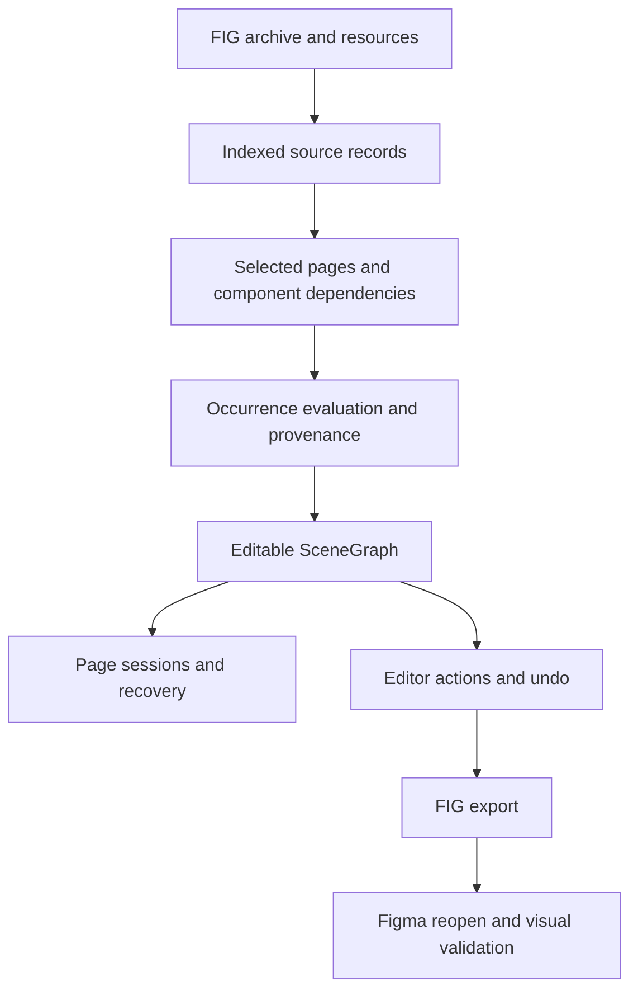

# .fig Reader Architecture

The reader replacement interprets Figma source records into independently editable scene
occurrences. Its completion criterion is one reader across the application, CLI, MCP, and
worker paths, with the superseded importer and repair pipeline removed.

::: warning Implementation status
The reader is the only import path: synchronous parsing, the document worker, page population,
recovery, export, and clipboard paste all use it, and the previous importer is removed.
Corpus-wide fidelity (export still reassigns node identities and drops some raw text metadata)
and performance acceptance remain unfinished. The diagram describes responsibilities, not a
claim of complete Figma parity.
:::



## Key distinctions

- A **source record** identifies an archive node; an **occurrence** identifies one use of it.
- An **owner** establishes the component scope for an override **claim**.
- An effective value is not enough to determine whether it is inherited or overridden.
- Saved appearance, editable layout, and exported-file fidelity are separate contracts.

```text
                         Inherited default       Explicit equal value
Initial text             "Badge"                 "Badge"
Component changes        "Updated"               "Updated"
Instance result          "Updated"               "Badge"
```

## Package documentation

The canonical implementation documentation lives alongside the package in
[`packages/fig/docs`](https://github.com/open-pencil/open-pencil/tree/master/packages/fig/docs).
This page is the development-site entry point, not a second copy of those contracts.

Read in order:

1. [Architecture and ownership](https://github.com/open-pencil/open-pencil/blob/master/packages/fig/docs/architecture.md)
2. [Source model and identities](https://github.com/open-pencil/open-pencil/blob/master/packages/fig/docs/source-model.md)
3. [Instance evaluation and precedence](https://github.com/open-pencil/open-pencil/blob/master/packages/fig/docs/instance-evaluation.md)
4. [SceneGraph materialization](https://github.com/open-pencil/open-pencil/blob/master/packages/fig/docs/materialization.md)
5. [Document sessions, rollback, and recovery](https://github.com/open-pencil/open-pencil/blob/master/packages/fig/docs/document-sessions.md)
6. [Export contracts](https://github.com/open-pencil/open-pencil/blob/master/packages/fig/docs/export.md)
7. [Validation and oracle methodology](https://github.com/open-pencil/open-pencil/blob/master/packages/fig/docs/validation.md)

See also [system architecture](./architecture), [testing](./testing), and the
[development roadmap](./roadmap). Fixture provenance belongs next to fixtures; individual
benchmark runs and temporary oracle results do not belong in architecture documentation.
