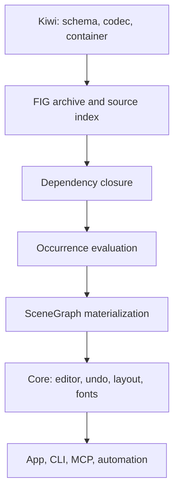

# Architecture

This shows responsibility flow, not a dependency graph of package imports.

## Ownership

| Domain | Owner |
| --- | --- |
| Kiwi schema/runtime and protocol containers | `@open-pencil/kiwi` |
| FIG archives, record interpretation, resource association, format conversion | `@open-pencil/fig` |
| Format-neutral graph, component-property mutations, override storage | `@open-pencil/scene-graph` |
| Editor actions, undo, render invalidation, layout scheduling, runtime fonts | `@open-pencil/core` |
| Worker lifecycle and format-neutral document I/O | Core |

**Required invariant:** adapters converge on the same document semantics. Neither Vue nor
an automation adapter implements an independent override resolver.

## Reader entry points

The package exposes record-based assembly, archive-owned assembly, and incremental sessions.
They share one evaluation/materialization path. Core uses it for synchronous parsing, the
document worker, page population, recovery, export of unloaded pages, and clipboard paste
(`materializeFigFragment`); CLI and MCP consume Core's `parseFigFile`. See
[document sessions](./document-sessions.md) for ownership and lifecycle details.

- [Archive parsing and assembly](../src/archive.ts)
- [Document reader](../src/document/read.ts)
- [Document materialization](../src/document/materialize.ts)
- [Public exports](../src/index.ts)

## Replacement boundary

There is one reader and no post-import repair replay. The previous importer, its lazy
population path, and its sync-repair helpers are deleted rather than kept as fallbacks; reusing
independent codec, font, geometry, and resource utilities is appropriate, retaining an old
interpretation algorithm behind renamed wrappers is not.

**Known limitation:** export reassigns node GUIDs and drops raw text metadata Figma keeps on
outlined vectors, so an edited design-system file does not yet round-trip node for node.
Corpus-wide fidelity and performance acceptance remain open; see [validation](./validation.md)
and the integration PR for current measurements.

Relevant boundaries:

- [Session worker](../../core/src/kiwi/fig/session/worker.ts)
- [Format-neutral FIG read orchestration](../../core/src/io/formats/fig/read.ts)
- [Page controller](../../core/src/editor/pages.ts)

Compatibility is judged against Figma, not output agreement with the implementation being
removed. See [validation](./validation.md).
