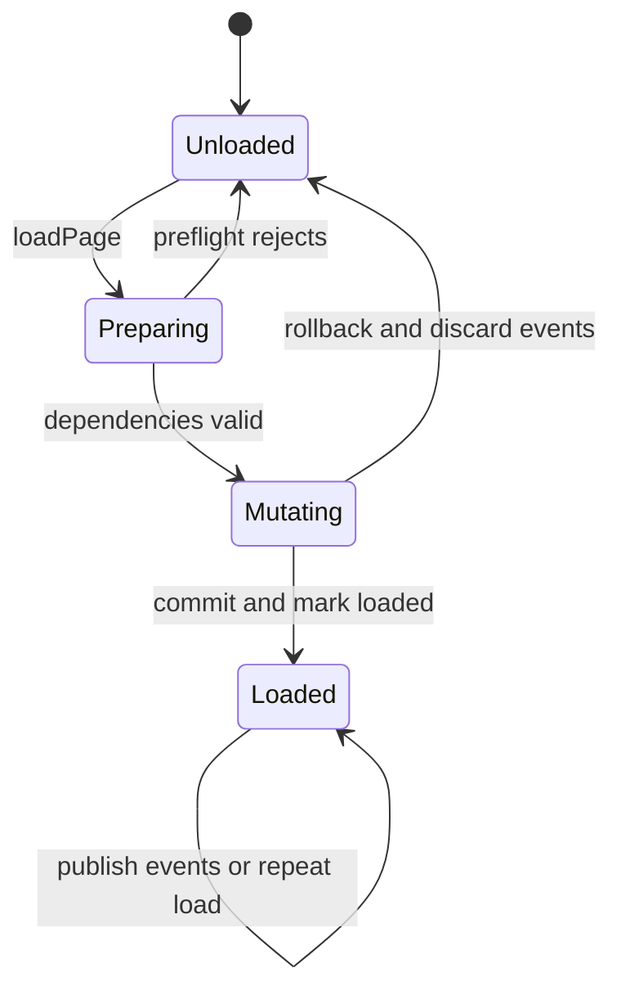
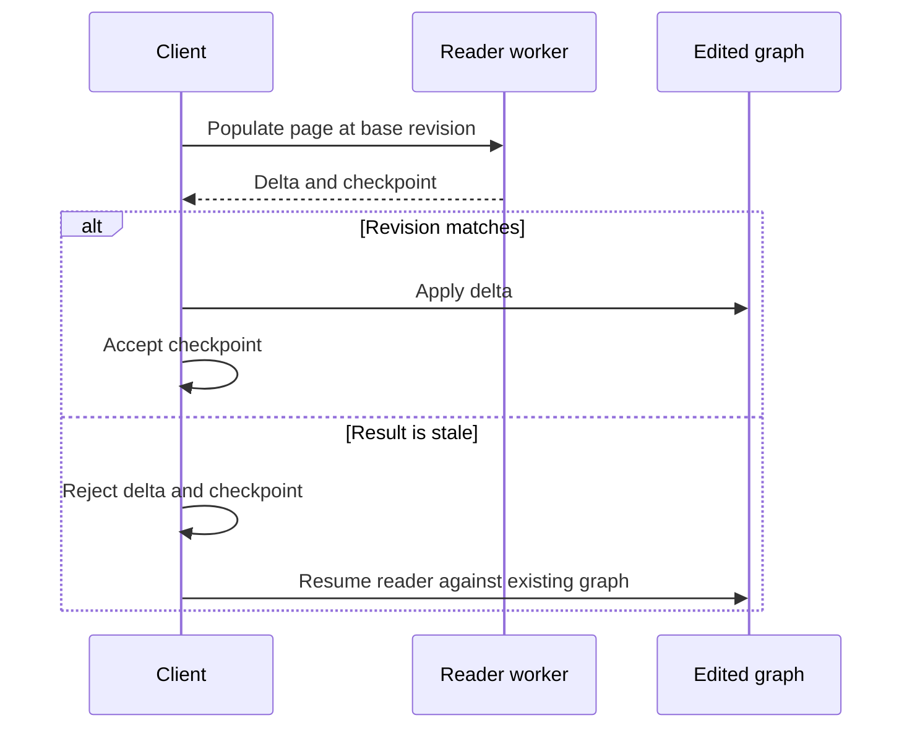

# Document sessions



Observer failure occurs after `Loaded`; it does not transition back to `Unloaded`.

## APIs and ownership

`materializeDocument(records)` copies caller data. `materializeFigArchive(bytes)` owns its
parsed records. Both support source-page selection through `pageIds`.

`createFigDocumentSession(bytes)` starts with page shells. `loadPage(sourcePageId)` adds content
to the same graph and is idempotent for loaded pages. `graphPageId(sourcePageId)` bridges source
IDs to runtime IDs used by worker requests. Existing graph/node identities and the editor's
undo manager must survive later loads and recovery.

Page loading is not a user edit: it must neither add undo commands nor clear redo history.
Failed-load rollback is separate from user undo.

`DocumentAssemblyOptions` extends the interpreter options: the handlers a session is created
with decide whether records addressing deleted nodes or components fail the load or are skipped
and reported. Broken hierarchy in the dependency closure is always fatal. Core creates its
open, recovery, and export sessions with one shared diagnostics sink per document.

## Transaction semantics

**Implemented:** a scoped synchronous journal restores selected existing nodes, child lists,
instance indexes, and reader lookup maps, and removes newly created nodes if the load action
throws. It is not a general SceneGraph transaction. Unrelated document payloads are not cloned.

Graph events are buffered until the mutation succeeds. Nested buffers merge into their outer
buffer. Observers run after the page is marked loaded. `CommittedGraphEventError` means graph
state committed but notification failed; callers must not retry as if the graph rolled back.
Queued events continue to be attempted. The underlying nanoevents dispatch may stop remaining
listeners for a single event when one listener throws.

## Worker results and recovery



Only an accepted delta advances the receiver's checkpoint. Original archive bytes remain
available for recovery and are released with session ownership. Recovery does not substitute
the old importer or replace the edited graph.

Checkpoints contain source-to-node mappings, loaded pages, saved-size tracking, and component
topology addressed by complete source-identity paths. Occurrence property payloads are
reconstructed from source records when recovery is needed. Restore validates paths, component
identity, coverage, and roots before attaching to graph nodes.

```text
Checkpoint stores                 Recovery reconstructs
-------------------------------   -------------------------------
source path -> graph node ID      occurrence properties
main-component identity           binding evaluation
loaded source page IDs            source-derived geometry
saved-size tracking               links to EXISTING graph objects
```

## Rollback example

```text
                      Before load   During load    After failure
Existing node ID       n17           n17            n17
Existing edit         "Custom"      "Custom"       "Custom"
New nodes             --            n21, n22        --
Loaded pages          {A}           {A}             {A}
Load notifications    --            buffered        discarded
```

This is load rollback, not an undo command. Existing user history remains intact.

## Known limitations

- Component child additions, deletions, and reordering are rejected before another page load;
  structural reconciliation is not implemented.
- All frontend lifecycle and cancellation scenarios are not yet accepted. Synchronous work
  cannot be interrupted merely by queuing a cancel message; transport termination is tested.
- Large-page construction and checkpoint costs still require performance work.
- Full production migration and removal of old parse paths are pending.

## Implementation and tests

- [Session and assembly API](../src/document/materialize.ts)
- [Page-load rollback](../src/document/load-transaction.ts)
- [Compact component checkpoints](../src/document/component/checkpoint.ts)
- [Buffered graph events](../../scene-graph/src/buffered-events.ts)
- [Worker backend](../../core/src/kiwi/fig/session/reader.ts)
- [Recovery](../../core/src/kiwi/fig/session/recovery.ts)
- [Session tests](../tests/document/session.test.ts)
- [Checkpoint validation](../tests/document/checkpoint.test.ts)
- [Worker/undo/recovery integration tests](../../../tests/engine/io/fig/session/)
