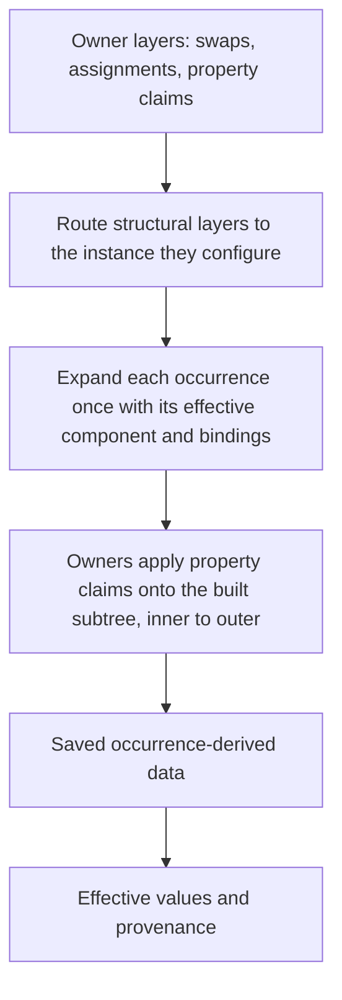

# Instance evaluation



The model has three parts. An instance expands its component's subtree. Every owner
contributes *layers*: a partial record at a path relative to that owner. Where layers
overlap, the outermost owner wins.

A layer is *structural* when it carries a swap (`overriddenSymbolID`) or component-property
assignments; it selects what a nested instance expands. Everything else is a *property* layer.
Structural layers are routed down to the instance they address before it expands, so each
occurrence expands exactly once with its effective component and complete assignment list.
Property layers are applied by their declaring owner after its subtree is built, which keeps
their values in that owner's coordinate space and orders inner owners before outer ones.

## Addressing

A property path is relative to its declaring owner. Ordinary containers may be traversed
without adding an instance boundary; nested instances require an explicit segment.

```text
Owner
  +-- instance A -> Label (source L)
  +-- instance B -> Label (source L)

[A, L] != [B, L]                 valid distinct addresses
[L] across an instance boundary  not an implicit recursive search
```

Component GUIDs and component override keys can address the root. A binding-driven replacement
can retain the source component's root identity without retaining its old descendant targets.
A placed instance's explicit size remains separate from unscaled root-override size.

## Provenance

| Origin | Interpretation |
| --- | --- |
| Component default | Inherited unless superseded. |
| Property assignment | Supplies a binding value; not equivalent to its default. |
| Explicit path override | Declared by an owner against a complete path. |
| Saved derived data | Effective geometry/typography; not automatically a user override. |
| Editor mutation | Recorded through the shared editing domains after materialization. |

```text
default Label = "Badge"
  +-- untouched instance -> inherits later component changes
  +-- explicit "Badge"  -> remains overridden despite equal text
```

Definitions with `parentPropDefId` inherit semantics within source ancestry while retaining
local property identity. Current typed `varValue` and `PROP_REF` parameter records are
normalized alongside older property forms.

**Implemented:** an outer owner's assignment supersedes an inner owner's explicit claim on the
same field; unrelated fields of that claim are kept. A claim whose path passes through a swapped
instance and resolved in the replaced component is stale and dropped. A missing target that did
not resolve there either is reported, never remapped onto a similarly named replacement child.

## Worked precedence example

```text
Contribution                text            opacity
--------------------------  --------------  -------
Component default           "Badge"         1.0
Intermediate explicit claim "Custom"        0.4
Outer text assignment       "Assigned"      --

Effective result            "Assigned"      0.4
Retained intermediate claim --              0.4
```

The outer assignment supersedes the intermediate text claim without erasing unrelated opacity.
Within one owner, its assignments bind before its explicit claims, so an explicit child claim
wins over that owner's own assignment to the same field.

```text
BEFORE SWAP                         AFTER SWAP
Component A                         Component B
  A/Label [explicit text claim]        B/Icon
  A/Icon                              B/Caption

A/Label does NOT become B/Caption merely because both contain text.
```

## Names

Stored `name` alone is not proof of an explicit rename. Figma save captures distinguish
root-targeted name claims. Untouched replacement instances use the component name, or the
component-set name for variants. Initial stored names are not globally rewritten.

**Known limitation:** complex compositions of inherited renames, bindings, and structural
swaps still have unresolved oracle cases. Direct `swapComponent()` behavior must not be assumed
to describe every saved-record composition.

## Derived text

Changing text or shaping properties invalidates inherited glyph caches unless a patch supplies
replacement data. Later occurrence-derived glyph data can replace that invalidated cache.
Paint-only changes do not alter glyph positions; every claim application applies the same
validity rule.
See [materialization](./materialization.md) for rendering and editing boundaries.

## Diagnostics

The library is strict by default: a missing or ambiguous target throws. `InterpretInstanceOptions`
lets a caller skip and report instead: `onUnresolvedProperty` and `onUnresolvedAssignment` for
records that address nodes the archive no longer contains, and `onMissingComponent` for an
instance of a deleted component, which then stays a childless instance with its saved
reference. A swap whose replacement is missing is always fatal. Reports retain owner, effective
component context, complete path, and assignment payload where applicable.

Figma retains such records after deletions, so the application reader opts into all three
(`readerSessionOptions` in Core) and exposes the collected records through
`readerDiagnostics(graph)`. Oracle tooling stays strict unless a flag names the concession.

## Implementation and tests

- [Interpreter](../src/instance-overrides/interpret.ts)
- [Static source routing](../src/instance-overrides/source-index.ts)
- [Occurrence path resolution](../src/instance-overrides/occurrence-path.ts)
- [Binding evaluation](../src/instance-overrides/interpret-bindings.ts)
- [Text provenance](../src/instance-overrides/text-provenance.ts)
- [Addressing tests](../tests/instance/addressing.test.ts)
- [Binding precedence tests](../tests/instance/bindings.test.ts)
- [Root-key tests](../tests/instance/root-key.test.ts)
- [Swap provenance tests](../tests/instance/swap-provenance.test.ts)
- [Name capture provenance](../tests/instance/fixtures/README.md)

**Known limitation:** field coverage and provenance transitions are not complete. Assignments
whose definition only exists on a detached ancestor are reported as unresolved rather than
remapped through `detachedSymbolId` lineage.
